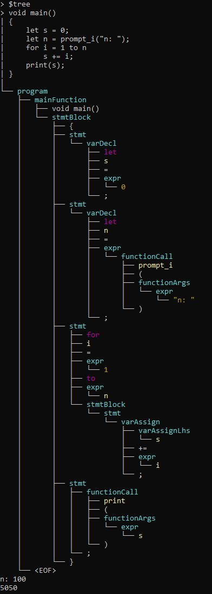

Pigeon is a programming language I've implemented using C# and ANTLR. It's not particularly complex, but it includes the basic features one would expect from a programming language.

Here’s an example of a recursive Fibonacci sequence generator:

```
int fibonacci(int i)
{
    if (i == 0 || i == 1)
        return i;
    return fibonacci(i - 1) + fibonacci(i - 2);
}

void main()
{
    let n = prompt_i("n: ");

    for i = 1 to n
        print(fibonacci(i));
}
```

More examples are available in the **PigeonTest/Samples** directory.

Pigeon supports the following data types:

* `int`
* `float`
* `string`
* `bool`
* `list<int>`
* `list<float>`
* `list<string>`
* `list<bool>`
* `set`

Variables are declared using `let` or `const`. Their type is inferred from the initial value:

* `0` → `int`
* `3.14` → `float`
* `true` → `bool`
* `"hello"` → `string`
* `list<int>()` → `list<int>`
* `set()` → `set`

Pigeon includes built-in functions for manipulating strings, lists, and sets. Developers can also inject their custom functions and variables directly into the interpreter.

 > *T = int, float, bool, or string*

```
int ftoi(float number);

int len(string str);
string get_char_at(string str, int index);
string set_char_at(string str, int index, string ch);

int len(list<T> l);
void sort(list<T> l, string direction);
void list_add(list<T> l, T element);

bool set_in(set s, T element);
void set_add(set s, T element);
void set_remove(set s, T element);
```

*If function returns `any`, variants with `_i` (int), `_f` (float), and `_b` (bool) suffixes are available.*

The core parsing and interpretation logic is packaged in a DLL, which can be integrated into other applications. For example, **PigeonCLI** is a console-based interface that uses this DLL.

**PigeonCLI** also comes with several built-in functions:

```
void print(T msg);
int prompt_i(string msg);
bool prompt_b(string msg);
float prompt_f(string msg);
string prompt_s(string msg);
```

Appropriate `prompt_` function must be used here because, as mentioned earlier, the datatype of variables is inferred by their initial value.

You can also pass the source file as an argument to the **PigeonCLI**.

```
PigeonCLI source.pig
```

To show the parsing tree in the command line, execute the `$tree` command beforehand.


